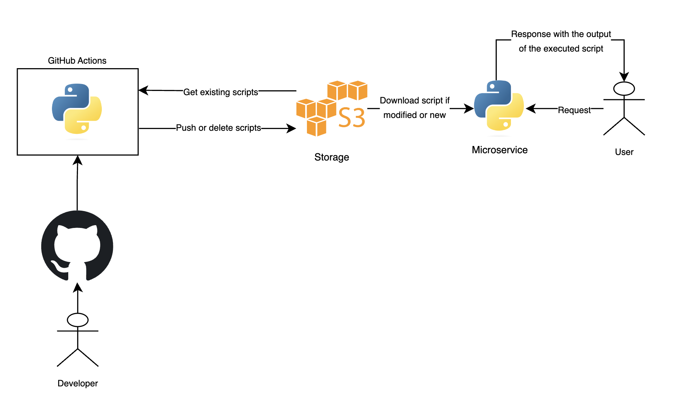

# microservice
Python microservice using REST architecture

## Running with Docker
```shell
docker build -t microservice .
docker run -p 8000:8000 -e AWS_ACCESS_KEY_ID=_aws_key_ -e AWS_SECRET_ACCESS_KEY=_aws_secret_ microservice
```

## Running without Docker
```shell
cd src
AWS_ACCESS_KEY_ID=_aws_key_ AWS_SECRET_ACCESS_KEY=_aws_secret_ python app.py
```

### QUESTION 3.: Describe how you would autoscale the microservice described at the point (1) [microservice] in a Kubernetes cluster:
a. Which Kubernetes object would you use?

- I would chose Horizontal Pod Autoscaler (HPA) which means that the number of pods under deployment would be increased/decreased accoriding to the metrics I use (answer b). Additionally, we could use Vertical Pod Autoscaler if we want to be able to scale up/down our resources like memory or CPU but using **HPA is better option** here since it will be faster to have multiple instances of microservices serving our clients. 

b. Which metrics would you monitor to efficiently autoscale the microservice?

- There are couple of metrics which can be used for this scenario:
    - If we have a message queue we can monitor the number of messages in a queue
    - If we don't have the queue, we can monitor memory and cpu consumptions

### QUESTION 4.: Design a visual diagram to explain the interaction between the components (microservice and repository) and the CI/CD pipeline flow



